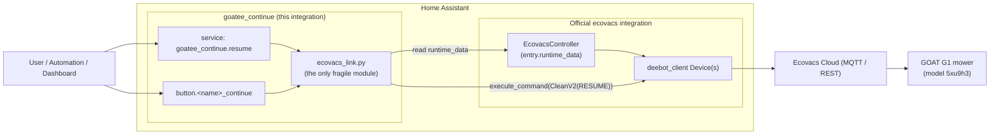
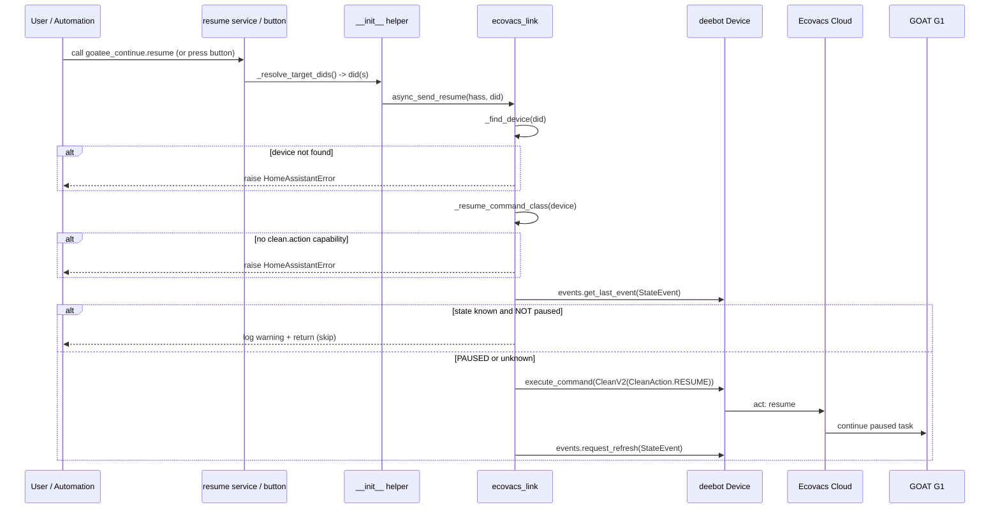

# Architecture

Goatee Continue is deliberately small. Its design goal is to add a *resume*
surface to Home Assistant **without** opening a second Ecovacs cloud session, and
to confine every fragile, version-dependent assumption to one module.

- [Option A — reuse the official session](#option-a--reuse-the-official-session)
- [Component diagram](#component-diagram)
- [How the live `Device` is obtained](#how-the-live-device-is-obtained)
- [Runtime symbol checks and error paths](#runtime-symbol-checks-and-error-paths)
- [Sequence of a resume call](#sequence-of-a-resume-call)
- [Fragility caveat](#fragility-caveat)
- [Why not Option B (standalone login)](#why-not-option-b-standalone-login)

---

## Option A — reuse the official session

There must be exactly **one** active Ecovacs cloud session per account; logging in
again can sign you out of the mobile app. So this integration does **not** log in.
Instead it borrows the already-authenticated `deebot_client.device.Device` that
the official `ecovacs` integration created and dispatches the resume command on
it. One account, one session, preserved.

All of that cross-integration reach-in lives in a single module,
[`ecovacs_link.py`](../custom_components/goatee_continue/ecovacs_link.py). The rest
of the integration (`__init__.py`, `button.py`, `config_flow.py`) only talks to
that module’s small public surface:

| Public helper | Used by |
| --- | --- |
| `async_send_resume(hass, did)` | the `resume` service and the button |
| `async_list_goat_devices(hass)` | the config flow (device picker) |
| `deebot_client_version()` | logging / diagnostics |

---

## Component diagram



---

## How the live `Device` is obtained

The lookup is implemented in `_iter_ecovacs_devices` and `_find_device`. The
primary path is the modern integration’s `runtime_data`:

```python
# custom_components/goatee_continue/ecovacs_link.py (abridged)
for entry in hass.config_entries.async_entries(ECOVACS_DOMAIN):
    controller = getattr(entry, "runtime_data", None)        # EcovacsController
    candidate = getattr(controller, "devices", None)         # list or callable
    if callable(candidate):
        candidate = candidate()
    devices.extend(_as_device_list(candidate))
```

Defensive details, all on purpose:

- `runtime_data` is expected to be an `EcovacsController` exposing a `devices`
  attribute. That attribute may be a **list/property** or, in some versions, a
  **callable** — both are handled.
- If nothing is found via `runtime_data`, it falls back to
  `hass.data["ecovacs"]` (legacy/alternative storage).
- `_as_device_list` keeps only objects that *look like* a deebot `Device` (they
  have a `device_info`), so unrelated objects are ignored.
- The deebot device id (“did”) is read from `device.device_info["did"]`
  (`ApiDeviceInfo` is a `TypedDict`, i.e. a plain dict at runtime), with an
  object-attribute fallback.

`_find_device(hass, did)` simply returns the first device whose did matches.

---

## Runtime symbol checks and error paths

Because the library API is reverse-engineered, the module verifies symbols at
call time rather than trusting them. Each failure raises a precise
`HomeAssistantError` (from `homeassistant.exceptions`):

| Check | Where | Raised error |
| --- | --- | --- |
| Official `ecovacs` integration loaded | `async_setup_entry` (`__init__.py`) | *“The official Ecovacs integration is not configured…”* |
| Device with the configured did exists | `async_send_resume` → `_find_device` | *“Could not find an Ecovacs device with id '…'…”* |
| Device exposes a clean-action capability | `async_send_resume` → `_resume_command_class` | *“…does not expose a clean-action capability…”* |
| `deebot_client.models.CleanAction` importable | `_resume_action` | *“deebot-client is not installed…”* |
| `CleanAction.RESUME` exists | `_resume_action` | *“This version of deebot-client has no CleanAction.RESUME…”* (logs the version) |
| `execute_command` succeeds | `async_send_resume` | *“Failed to send resume command to '…': &lt;err&gt;”* |

Two checks deliberately **do not** raise — they degrade gracefully:

- `_device_is_resumable` returns `None` when the state is unknown (no `StateEvent`
  yet); the caller then proceeds and lets the device/library decide.
- The post-dispatch `events.request_refresh(StateEvent)` is best-effort and never
  fatal (purely cosmetic state freshening).

---

## Sequence of a resume call



---

## Fragility caveat

> **Reaching into another integration’s `runtime_data` is not a stable, public
> Home Assistant API.** `EcovacsController`, its `.devices` attribute, the
> `deebot-client` `Device` shape, `device.capabilities.clean.action.command`, and
> `CleanAction.RESUME` are all internal details that can change without notice on
> a Home Assistant core, `ecovacs`, or `deebot-client` upgrade.

Mitigations baked into the design:

- **One module.** Every fragile access is in `ecovacs_link.py` — one small,
  heavily-commented place to fix.
- **Defensive shapes.** List-vs-callable `devices`, dict-vs-object `device_info`,
  and a `hass.data` fallback are all handled.
- **Runtime verification.** Missing symbols raise a clear `HomeAssistantError`
  that includes the installed `deebot-client` version, so a break after an upgrade
  is diagnosable from the logs rather than a stack trace.

**Validated against:**

| Component | Version |
| --- | --- |
| Home Assistant core | ~2026 stable (`ecovacs` using `ConfigEntry.runtime_data` → `EcovacsController.devices`) |
| `deebot-client` | **6.0.2** |
| Minimum HA (manifest / `hacs.json`) | `2024.12.0` |

After any upgrade, re-run the recon in
[docs/development.md](development.md#re-verifying-after-an-upgrade).

---

## Why not Option B (standalone login)

**Option B** would have this integration authenticate to Ecovacs with its own
credentials (a second account or a second session), independent of the official
integration. The code **does not do this**, by design:

- A second session can **log you out of the Ecovacs mobile app** (one active
  session per account).
- It would duplicate credential storage and the full auth flow for no functional
  gain — Option A already has a working, authenticated `Device`.

Option B remains the documented fallback *if* Home Assistant ever stops exposing
the device through `runtime_data` and no replacement is available. It is not
implemented here; there is no second-login code path in the repo.

---

See also: [how it works](how-it-works.md) · [installation](installation.md) ·
[API reference](api-reference.md) · [troubleshooting](troubleshooting.md)
