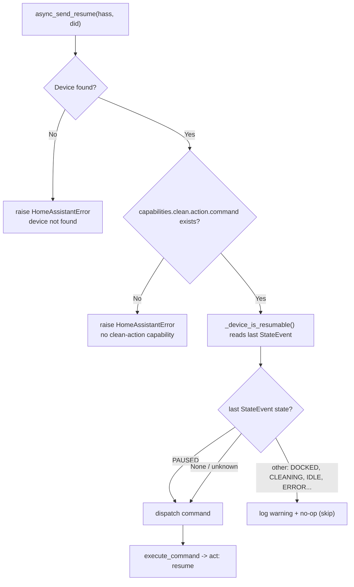

# Usage

- [The `goatee_continue.resume` action](#the-goatee_continueresume-action)
- [The Continue button](#the-continue-button)
- [Automation examples](#automation-examples)
- [The idempotent-safe guard](#the-idempotent-safe-guard)
- [Known timing caveat: docked/paused flapping](#known-timing-caveat-dockedpaused-flapping)
- [Verifying the behavioural fix on your GOAT](#verifying-the-behavioural-fix-on-your-goat)

---

## The `goatee_continue.resume` action

Continues the paused, unfinished mowing task (sends `act: resume`, the app’s
“Continue”). Unlike `lawn_mower.start_mowing`, it does **not** restart the map.

**Targets (all optional):**

| Field | Type | Selector | Default |
| --- | --- | --- | --- |
| `device_id` | list of HA device ids | `device` (`integration: ecovacs`) | — |
| `entity_id` | list of entity ids | `entity` (`domain: lawn_mower`, `integration: ecovacs`) | — |

**With no target, every configured GOAT is resumed.** This is the common case and
exactly what the button does. When you do pass targets, they are resolved to
deebot device ids and intersected with the devices this integration is configured
for, so a stray target can never act on an unrelated Ecovacs device.

```yaml
# Resume every configured GOAT
action: goatee_continue.resume

# Target a specific lawn mower entity
action: goatee_continue.resume
target:
  entity_id: lawn_mower.goatee

# Target a specific HA device
action: goatee_continue.resume
target:
  device_id: 1a2b3c4d5e6f...
```

> In current Home Assistant, `action:` is the modern key for what older YAML wrote
> as `service:`. Both work; examples here use `action:`.

---

## The Continue button

For each configured GOAT, the integration creates a button entity:

| Property | Value |
| --- | --- |
| Entity id | `button.<name>_continue` (e.g. `button.goatee_continue`) |
| Friendly name | **“Continue”** (`nb`: *“Fortsett”*) — uses `_attr_has_entity_name` |
| Icon | `mdi:play-pause` |
| Unique id | `<did>_continue` |
| Device | grouped under the existing Ecovacs device (identifier `("ecovacs", <did>)`) |

Pressing it runs exactly the same `async_send_resume(did)` path as the service.
Drop it on a dashboard or call `button.press` from an automation.

```yaml
action: button.press
target:
  entity_id: button.goatee_continue
```

---

## Automation examples

**Resume after rain clears** (a rain binary sensor turns off):

```yaml
automation:
  - alias: "Resume mowing when the rain stops"
    triggers:
      - trigger: state
        entity_id: binary_sensor.rain
        to: "off"
        for: "00:10:00"
    conditions:
      - condition: state
        entity_id: lawn_mower.goatee
        state: "paused"
    actions:
      - action: goatee_continue.resume
        target:
          entity_id: lawn_mower.goatee
```

**Resume once the battery has recovered:**

```yaml
automation:
  - alias: "Resume mowing after charge"
    triggers:
      - trigger: numeric_state
        entity_id: sensor.goatee_battery
        above: 80
    conditions:
      - condition: state
        entity_id: lawn_mower.goatee
        state: "paused"
    actions:
      - action: goatee_continue.resume
```

**Resume from a dashboard button** (no automation needed) — add the
`button.goatee_continue` entity to a dashboard, or a button card:

```yaml
type: button
name: Continue mowing
icon: mdi:play-pause
tap_action:
  action: perform-action
  perform_action: goatee_continue.resume
```

---

## The idempotent-safe guard

Before dispatching, `async_send_resume` checks the device’s last reported state
and **skips with a warning** if it positively knows the device is **not** paused.
The guard keys **only on `PAUSED`**:

```python
# custom_components/goatee_continue/ecovacs_link.py
_RESUMABLE_STATE_NAMES = {"PAUSED"}
```



Behaviour summary:

| Last known state | Result |
| --- | --- |
| `PAUSED` | **Dispatch** `CleanV2(CleanAction.RESUME)` |
| Unknown (no `StateEvent` yet) | **Dispatch** — the library decides (see below) |
| Anything else (`DOCKED`, `CLEANING`, `IDLE`, `ERROR`, …) | **Skip**: log a warning, no command sent |

The skip log line is:

```
Skipping resume for '<name>': device is not in a paused/resumable state
(nothing to continue). Use lawn_mower.start_mowing to begin a new task.
```

Even when the integration does dispatch, `deebot-client` adds a second safety net:
`Clean._execute` (inherited by `CleanV2`) downgrades `RESUME` → `START` if the
device isn’t actually paused, and upgrades `START` → `RESUME` if it is. So a
resume is only ever honoured when there is a paused task to continue.

---

## Known timing caveat: docked/paused flapping

> **This is a known limitation — current behaviour is described, not changed.**

On the GOAT G1, a paused task is often still preserved while the mower sits on the
dock, and the reported state can **flap between `docked` and `paused`** in that
situation. Because the guard keys only on `PAUSED`, a resume call that happens to
land in a `docked` instant is **skipped** (warning + no-op), even though the app
would show *“Continue”* as available.

What this means in practice:

- If you fire `goatee_continue.resume` and nothing happens, check the logs for the
  “Skipping resume … not in a paused/resumable state” warning, and simply retry —
  the next sample is often `paused`.
- For automations, prefer triggering on the `paused` state (optionally with a
  short `for:`) so the call coincides with a `paused` sample, as in the examples
  above.
- This is not corrected in code here (doing so would change runtime behaviour).
  It is tracked as a known limitation; see
  [troubleshooting](troubleshooting.md#resume-was-skipped).

The exact on-device flapping window **must be confirmed on the live device** — it
depends on firmware and dock state.

---

## Verifying the behavioural fix on your GOAT

The end-to-end *behavioural* result can only be confirmed on real hardware:

1. Start a mow, let it reach a few %, then `lawn_mower.pause` and
   `lawn_mower.dock` (or let it park) so the app shows *“Task paused / Continue”*.
2. Note `sensor.goatee_area_cleaned` (or the app’s mowed-%).
3. Call `goatee_continue.resume` (or press `button.goatee_continue`). The mower
   should **continue**: the % climbs from where it was, and the area-cleaned
   sensor does **not** reset.
4. For contrast, repeat but call `lawn_mower.start_mowing` instead — you should
   see the % reset to ~1% and the area-cleaned sensor drop.

---

See also: [how it works](how-it-works.md) · [API reference](api-reference.md) ·
[troubleshooting](troubleshooting.md)
