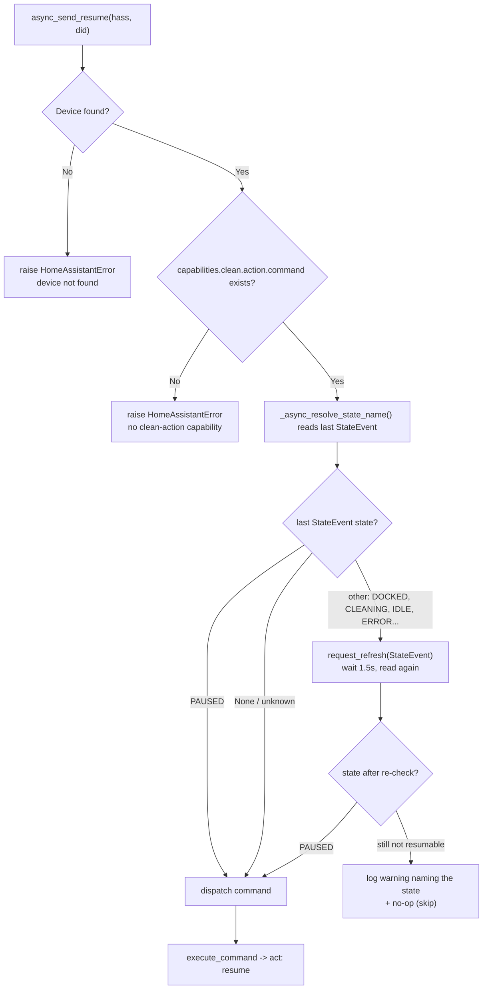

# Usage

- [The `ecovacs_resume.resume` action](#the-ecovacs_resumeresume-action)
- [The Continue button](#the-continue-button)
- [Automation examples](#automation-examples)
- [The idempotent-safe guard](#the-idempotent-safe-guard)
- [Known timing caveat: docked/paused flapping](#known-timing-caveat-dockedpaused-flapping)
- [Verifying the behavioural fix on your mower](#verifying-the-behavioural-fix-on-your-mower)

---

## The `ecovacs_resume.resume` action

Continues the paused, unfinished mowing task (sends `act: resume`, the app’s
“Continue”). Unlike `lawn_mower.start_mowing`, it does **not** restart the map.

**Targets (all optional):**

| Field | Type | Selector | Default |
| --- | --- | --- | --- |
| `device_id` | list of HA device ids | `device` (`integration: ecovacs`) | — |
| `entity_id` | list of entity ids | `entity` (`domain: lawn_mower`, `integration: ecovacs`) | — |

**With no target, every configured mower is resumed.** This is the common case and
exactly what the button does. When you do pass targets, they are resolved to
deebot device ids and intersected with the devices this integration is configured
for, so a stray target can never act on an unrelated Ecovacs device.

```yaml
# Resume every configured mower
action: ecovacs_resume.resume

# Target a specific lawn mower entity
action: ecovacs_resume.resume
target:
  entity_id: lawn_mower.goatee

# Target a specific HA device
action: ecovacs_resume.resume
target:
  device_id: 1a2b3c4d5e6f...
```

> In current Home Assistant, `action:` is the modern key for what older YAML wrote
> as `service:`. Both work; examples here use `action:`.

---

## The Continue button

For each configured mower, the integration creates a button entity:

| Property | Value |
| --- | --- |
| Entity id | `button.<name>_continue` (e.g. `button.ecovacs_resume`) |
| Friendly name | **“Continue”** (`nb`: *“Fortsett”*) — uses `_attr_has_entity_name` |
| Icon | `mdi:play-pause` |
| Unique id | `<did>_continue` |
| Device | grouped under the existing Ecovacs device (identifier `("ecovacs", <did>)`) |

Pressing it runs exactly the same `async_send_resume(did)` path as the service.
Drop it on a dashboard or call `button.press` from an automation.

```yaml
action: button.press
target:
  entity_id: button.ecovacs_resume
```

---

## Automation examples

**Resume after rain clears** (a rain binary sensor turns off):

```yaml
automation:
  - alias: "Resume mowing when the rain stops"
    triggers:
      - trigger: state
        entity_id: binary_sensor.rain
        to: "off"
        for: "00:10:00"
    conditions:
      - condition: state
        entity_id: lawn_mower.goatee
        state: "paused"
    actions:
      - action: ecovacs_resume.resume
        target:
          entity_id: lawn_mower.goatee
```

**Resume once the battery has recovered:**

```yaml
automation:
  - alias: "Resume mowing after charge"
    triggers:
      - trigger: numeric_state
        entity_id: sensor.goatee_battery
        above: 80
    conditions:
      - condition: state
        entity_id: lawn_mower.goatee
        state: "paused"
    actions:
      - action: ecovacs_resume.resume
```

**Resume from a dashboard button** (no automation needed) — add the
`button.ecovacs_resume` entity to a dashboard, or a button card:

```yaml
type: button
name: Continue mowing
icon: mdi:play-pause
tap_action:
  action: perform-action
  perform_action: ecovacs_resume.resume
```

---

## The idempotent-safe guard

Before dispatching, `async_send_resume` checks the device’s last reported state
and **skips with a warning** if it positively knows the device is **not** paused.
The guard keys **only on `PAUSED`**:

```python
# custom_components/ecovacs_resume/ecovacs_link.py
_RESUMABLE_STATE_NAMES = frozenset({"PAUSED"})
_STATE_RECHECK_DELAY_SECONDS = 1.5
```



Behaviour summary:

| Last known state | Result |
| --- | --- |
| `PAUSED` | **Dispatch** `CleanV2(CleanAction.RESUME)` immediately |
| Unknown (no `StateEvent` yet) | **Dispatch** — safe, see below |
| Anything else (`DOCKED`, `CLEANING`, `IDLE`, `ERROR`, …) | Refresh and look again; dispatch if it now reads `PAUSED`, otherwise **skip** with a warning |

The skip log line names the state and the model class, so a flapping dock is
visible in the log rather than being guesswork:

```
Skipping resume for 'GOAT A1600 LiDAR Pro' (model class e4gqia): device state is
DOCKED, not one of PAUSED, so there is no paused task to continue. Use
lawn_mower.start_mowing to begin a new task.
```

### Why the guard is load-bearing

`deebot-client` is **not** a safety net here — it is the hazard. `Clean._execute`
(inherited by `CleanV2`) rewrites `RESUME` → **`START`** when the device is not
paused, and a `START` restarts the map. By only dispatching after positively
observing `PAUSED`, this integration ensures the library sees the same `PAUSED`
state and never takes that branch. When no state has been reported at all, the
library's `if state` is falsy and the raw `act: resume` goes out untouched — also
safe.

The integration **never** falls back to `start_mowing`. If resuming is not
possible it skips and logs; deciding whether to start a new task instead is your
automation's call.

---

## Known timing caveat: docked/paused flapping

> **This is a known limitation — current behaviour is described, not changed.**

On the GOAT G1, a paused task is often still preserved while the mower sits on the
dock, and the reported state can **flap between `docked` and `paused`** in that
situation. A resume call landing in a `docked` instant would be skipped even
though the app shows *“Continue”* as available.

**Mitigation (2.0):** when the state reads as non-resumable, the integration does
not skip straight away. It calls `request_refresh(StateEvent)`, waits
`_STATE_RECHECK_DELAY_SECONDS` (1.5 s), and reads the state once more. A stale
`DOCKED` sample that is really a paused task is therefore usually caught on the
second look. The re-check can only *add* a resume that would otherwise have been
skipped — it never converts a resume into a start.

This narrows the window but cannot close it: the guard still, deliberately,
refuses to dispatch on a genuinely non-paused device, because doing so would let
`deebot-client` rewrite the command into a map-restarting `START`.

What this means in practice:

- If you fire `ecovacs_resume.resume` and nothing happens, check the logs for the
  “Skipping resume …” warning — it names the state that caused the skip — and
  simply retry; the next sample is often `paused`.
- For automations, prefer triggering on the `paused` state (optionally with a
  short `for:`) so the call coincides with a `paused` sample, as in the examples
  above.
- See [troubleshooting](troubleshooting.md#resume-was-skipped).

Whether the **A1600 LiDAR Pro** flaps the same way **must be confirmed on the live
device** — it depends on firmware and dock state.

---

## Verifying the behavioural fix on your mower

The end-to-end *behavioural* result can only be confirmed on real hardware:

1. Start a mow, let it reach a few %, then `lawn_mower.pause` and
   `lawn_mower.dock` (or let it park) so the app shows *“Task paused / Continue”*.
2. Note the session area sensor and the app's mowed-%. **The entity id differs by
   model**: `sensor.<mower>_area_mowed` on the A1600, `sensor.<mower>_area_cleaned`
   on the G1 (see the [naming table in the README](../README.md#mowed-vs-cleaned-sensor-naming)).
3. Call `ecovacs_resume.resume` (or press `button.<mower>_continue`). The mower
   should **continue**: the % climbs from where it was, and the area sensor does
   **not** reset to `0.0`.
4. For contrast, repeat but call `lawn_mower.start_mowing` instead — you should
   see the % reset to ~1% and the area sensor drop.

A reset in step 3 means the firmware treated the resume as a new task. Report it;
do not work around it by adding a fallback.

---

See also: [how it works](how-it-works.md) · [API reference](api-reference.md) ·
[troubleshooting](troubleshooting.md)
